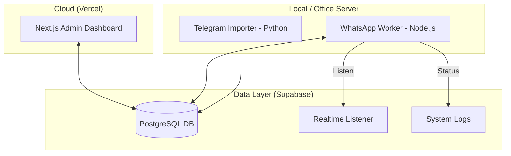

# Architecture Overview: RSVP Automation System

This document describes the high-level architecture and data flow of the RSVP management and automation system.

## System Components

The system consists of three main layers interacting via a central Supabase database:

### 1. Management UI (Next.js)
- **Deployment**: Vercel.
- **Function**: Allows administrators to view guest lists, trigger bulk send jobs, and monitor real-time worker logs.
- **Connection**: Direct connection to Supabase via `anon` key.

### 2. Telegram Importer (Python)
- **Script**: `telegram_import.py`.
- **Function**: Scans specified Telegram groups for contact cards and text messages.
- **Logic**: 
    - Deduplicates contacts within the scan session.
    - Checks for existing phones in the database.
    - Generates a `contacts_import.json` report for audit.
- **Trigger**: Run manually via command line.

### 3. WhatsApp Worker (Node.js)
- **Script**: `remote_worker.mjs`.
- **Function**: The "heart" of the automation. It runs on a physical machine to maintain a WhatsApp Web session.
- **Integration**:
    - **Realtime**: Listens for new rows in the `jobs` table.
    - **Worker Flow**: Picks up a job -> Fetches guests -> Sends messages with random delays (5-10s) -> Updates job status.
- **Persistence**: Managed via **PM2** to ensure it restarts on system reboot.

## Data Flow: Sending Invitations

1. Admin clicks **"Send Bulk"** in the Web UI.
2. A new `pending` job is inserted into the `jobs` table in Supabase.
3. The **WhatsApp Worker** (Office Server) receives a Realtime event.
4. The worker initializes the browser, sends invitations, and reports progress back to the `system_logs` table.
5. The Web UI displays the logs in real-time for the admin to monitor.

## Crucial Environment Variables

Located in `.env.local` and script headers:
- `SUPABASE_URL`: The API endpoint for the database.
- `SUPABASE_KEY`: The public/anon key (for UI and scraper).
- `API_ID` / `API_HASH`: Required for Telethon (Telegram API) access.
- `GROUP_NAME`: The specific Telegram invite link or group name to scan.
